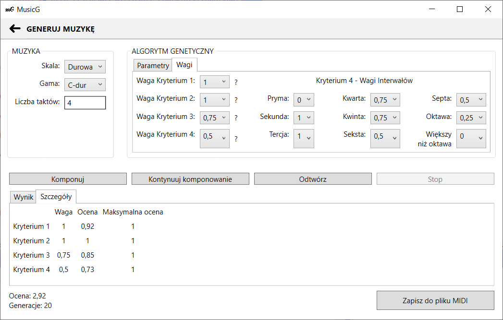

# MusicG
The MusicG application, which uses a genetic algorithm to generate music phrases, was implemented using Windows Presentation Foundation (WPF) technology for developing desktop applications with a Graphical User Interface (GUI) for Windows. It was created to support composers during the process of composing music by suggesting generated pieces of music, which can serve as inspiration or elements that can be used in a musical piece.

## Table of contents
* [Technology](#technology)
* [Requirements](#requirements)
* [Screenshots](#screenshots)

## Technology
Project is created with:
* Windows Presentation Foundation (WPF)
* C#
* XAML

## Requirements 
* .NET Framework 4.7.2

## Screenshots

    
    <em>Main menu</em>

 

    
    <em>Generate music</em>

 

    
    <em>Details</em>

 

    
    <em>About</em>

